**BUSINESS AND FINANCIAL ANALYSIS OF HELLA**

**Name: Arun Akash Jawahar**

**Student Id: Q1036637**

**October Intake, Group 1**

**Date: 08/02/2023**

Statement of compliance with academic ethics and the avoidance of
plagiarism

I honestly declare that this assignment is entirely my own work and none
of its part has been copied from printed or electronic sources,
translated from foreign sources and reproduced from essays of other
resources or students. Wherever I have been based on ideas or other
people texts I clearly declare it through the good use of references
following academic ethics.

**ARUN AKASH JAWAHAR**

**08/02/2023\
**

**ABSTRACT**

Hella is one of the leading Auto motive parts manufacturing companies,
however a Business and financial analysis is done to get to know how the
company is really performing. The results are comparted to the
Continental AG which is also an Auto motive parts manufacturing company.
In Business analysis the SWOT and PESTLE analysis of both companies were
done and compared to get the whole picture about the company's
situation, In Financial analysis I have done the Ratio analysis and the
results were compared between the companies. By this analysis we can get
how both the companies are performing and whether the main company
should concern about its competitor performance. In this study I have
analysed the impact of Covid on both companies and how they performed
after the post Covid. And for conclusion I have given my thoughts about
the companies and its performance and some suggestions for improving the
company.

**TABLE OF CONTENT**

  ------------------------------------------------------------------------
  S.NO      Particulars                                          Page
  --------- ---------------------------------------------------- ---------
  1         Introduction                                         

  1.1       Hella                                                

  1.2       Continental AG                                       

  2         Task 1                                               

  2.1       Return on Capital Employed                           

  2.2       Return on Sales                                      

  2.3       Asset utilisation ratio                              

  2.4       Gross profit margin                                  

  2.5       Current ratio                                        

  2.6       Gearing                                              

  2.7       Interest coverage ratio                              

  2.8       Stock days                                           

  2.9       Current trade receivable days                        

  2.10      Current trade payable days                           

  2.11      Return on Equity                                     

  2.12      Common size analysis                                 

  2.13      Du-Pont analysis                                     

  3         Task 2                                               

  3.1       Horizontal analysis                                  

  3.2       Leverage ratio                                       

  3.2.1     Debt to Equity ratio                                 

  3.2.2     Debt to Asset ratio                                  

  3.2.3     Equity to Asset ratio                                

  3.2.4     Degree of Financial leverage                         

  3.3       Growth rate analysis                                 

  3.3.1     P/E ratio                                            

  3.3.2     PEG ratio                                            

  3.4       Profitability analysis                               

  3.4.1     Operating profit margin                              

  3.4.2     Net profit margin                                    

  3.4.3     Cash flow margin                                     

  3.5       Liquidity analysis                                   

  3.5.1     Cash ratio                                           

  3.6       Efficiency analysis                                  

  3.7       Cash flow analysis                                   

  3.7.1     Operating cash flow                                  

  3.7.2     Free cash flow                                       

  3.8       Rate of return analysis                              

  3.8.1     Return on Assets                                     

  4         Business Analysis                                    

  4.1       SWOT analysis                                        

  4.2       PESTLE analysis                                      

  5         Results                                              

  6         Discussion                                           

  6.1       Whether the Hella should concern about Continental   

  7         References                                           
  ------------------------------------------------------------------------

**1.INTRODUCTION**

In this highly competitive market, it is crucial for businesses to
improve their understanding of business and financial terms in order to
assess their various financial operations. This information aids the
firm in analysing the commercial and financial market trends in the
cutthroat marketplace (Walker, 2009). Thus, the primary goal of this
report is to provide a comparison study that can assist in demonstrating
the differences between two firms that are active in the same sector.

In this study, I\'ve chosen the MDAX-listed HELLA as the main company.
Additionally, Continental AG is chosen as the secondary company to help
demonstrate the comparison with Hella by employing trend analysis and
ratio analysis in order to compare performance.

This report starts with the introduction of both selected companies.
This report also highlights the business and financial performance of
both companies that define the company's financial position and its
business strategies.

Moreover, the SWOT and PESTLE analysis is used to analyse the business
performance and the ratio analysis is also used in this report to
analyse the financial performance of the companies. For conducting the
comparison between both the companies, different ratios such as
liquidity ratio, efficiency ratio, profitability ratio, leverage ratio
and cash flow ratios and rate of returns are used.

1.  HELLA:

A multinational, family-owned business called HELLA GmbH & Co KGaA
(HELLA) designs and produces lighting and electronic systems for the
automotive industry. The company\'s headquarters are in Lippstadt,
Germany, and it was established on June 11th, 1899. Automotive,
Aftermarket, and Special Applications are its three main business
divisions. The Automotive segment creates, makes, and markets solutions
tailored specifically for automobiles. The automobile parts and
accessory trade, workshop supplies, and wholesale industry are all
included in the aftermarket category. Original equipment for special
purpose vehicles is included in the Special Application categories.

2.  CONTINENTAL:

Founded on October 8, 1871, CONTINENTAL AG is a holding corporation with
its headquarters in Hanover, Germany. Operating segments include Tires,
ContiTech, Interior, Powertrain, Chassis and Safety, and
Other/Consolidation. The Chassis and Safety sector integrates
intelligent systems to enhance driving safety and vehicle dynamics. The
Interior segment creates individual parts as well as a whole system for
connected mobility. Fuel consumption is minimized in the Tires segment
by lowering rolling resistance. The ContiTech department handles all
aspects of product development, manufacturing, and marketing for the
mining, automotive, machine, and plant engineering industries. The
Other/Consolidation division comprises holding, finance, and insurance
companies as well as centralized-controlled subsidiaries and affiliates.

**TASK 1**

2.1 Return on Capital Employed:

ROCE measures how efficiently a company is using its capital to generate
profit. It is one of the profitability ratios.

> ROCE = $\frac{EBIT}{CAPITAL\ EMPLOYED}$

{width="3.052509842519685in"
height="0.645923009623797in"}

2.2 Return on Sales:

ROS measures how much profit is produces per sales. It is used to
evaluate a company's operational efficiency.

> ROS = $\frac{OPERATING\ PROFIT}{NET\ SALES}$

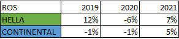{width="3.0420909886264216in"
height="0.6667596237970254in"}

2.3 Asset Utilisation Ratio:

Asset utilisation ratio measures the total revenue earned for the total
asset a company owns. It determines how efficiently the company uses its
asset to generate profit.

> Asset utilisation ratio = $\frac{NET\ SALES}{AVERAGE\ TOTAL\ ASSET}$

{width="3.3546347331583553in"
height="0.645923009623797in"}

2.4 Gross Profit Margin:

Gross profit margin is used to assess a company's financial health. It
is the amount of money left over after reducing the cost spend for
selling the products.

> Gross profit margin = $\frac{GROSS\ PROFIT}{TOTAL\ REVENUE}$

{width="3.3546347331583553in"
height="0.6667596237970254in"}

2.5 Current Ratio:

Current ratio measures a company's ability to meet its short-term
liabilities. It is one of the liquidity ratios.

> Current ratio = Current Asset -- Current liability

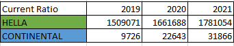{width="3.5629975940507435in"
height="0.7084317585301837in"}

2.6 Gearing:

Gearing measures, a company's financial leverage. It shows how the
business is funded whether through debt or equity.

> Debt to Equity ratio = $\frac{TOTAL\ DEBT}{TOTAL\ EQUITY}$

{width="3.7192694663167103in"
height="0.8021948818897637in"}

2.7 Interest Coverage Ratio:

It measures how well a firm can pay the interest due.

> Interest Coverage ratio = $\frac{EBIT}{INTEREST\ EXPENSES}$

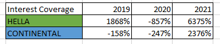{width="3.771359361329834in"
height="0.7605227471566054in"}

2.8 Stock Days:

Stock days determine the efficiency of sales of the business. It is also
called as Day sales of inventory (DSI).

> Stock days = $\frac{AVERAGE\ INVENTORY}{COGS}$ \* 365

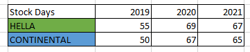{width="3.760941601049869in"
height="0.7813593613298337in"}

2.9: Current Trade Receivable Days:

It measures how efficiently a company is collecting the credit sales
amount from their clients.

> Account receivable days =
> $\frac{AVERAGE\ ACCOUNTS\ RECEIVABLES}{NET\ CREDIT\ SALES}$ \* 365

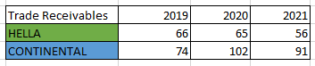{width="3.6775962379702536in"
height="0.7709405074365704in"}

2.10: Current Trade Payable Days:

It measures the rate at which a company pays off their purchase amount
to the suppliers.

> Account payable days = $\frac{AVERAGE\ ACCOUNTS\ PAYABLE}{COGS}$ \*
> 365

{width="3.7192694663167103in"
height="0.7917771216097987in"}

2.11: Return on Equity:

ROE measures how efficiently the company is converting its equity
financing into profit.

> ROE = $\frac{NET\ INCOME}{SHAREHOLDERS\ EQUITY}$

{width="3.781778215223097in"
height="0.7917771216097987in"}

2.12: Common Size Analysis:

It is also known as Vertical analysis. Each line item is expressed as a
percentage of the base amount for that time to analyse financial
statements. It helps to understand the impact and the contribution of
each item to the financial statement.

{width="6.268055555555556in"
height="3.592361111111111in"}

{width="6.268055555555556in"
height="6.886111111111111in"}

2.13: DuPont Analysis:

DuPont analysis is used to break the ROE and determine what financial
activities are contributing more to the change in ROE.

DuPont ROE = $\frac{NET\ INCOME}{REVENUE}$ \*
$\frac{REVENUE}{AVERAGE\ TOTAL\ ASSET}$
\*$\frac{AVERAGE\ TOTAL\ ASSET}{AVERAGE\ SHAREHOLDERS\ EQUITY}$

{width="3.2191994750656168in"
height="0.7501049868766404in"}

**TASK 2**

FINANCIAL ANALYSIS:

It is the process of analysis the financial statements of a firm to
develop changes required for improvement of the business. It helps to
get a clear picture of company's performance and can be compared with
the competitor's company. And with the findings financial suggestions
are made for companies' growth.

3.1 Horizontal Analysis:

It is used to evaluate the financial performance of a company over a
period. This analysis compares the prior financial results of a company
with the current results to spot the changed which has made.

{width="6.268055555555556in"
height="5.770138888888889in"}

{width="6.268055555555556in"
height="3.0388888888888888in"}

3.2: Leverage Analysis:

It measures the financial strength of the company. It denotes how much
the company has borrowed for the business with the base of equity or
asset.

3.2.1: Debt to Equity Ratio:

This ratio shows how much debt the company owns to how much equity they
have.

> Debt to Equity ratio = $\frac{TOTAL\ DEBT}{TOTAL\ EQUITY}$

{width="3.2921259842519683in"
height="0.8230314960629921in"}

3.2.2: Debt to Asset Ratio:

This ratio shows how much debt the company owes irrespective to its
total asset owned by the company.

> Debt to Asset ratio = $\frac{TOTAL\ DEBT}{TOTAL\ ASSET}$

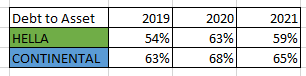{width="3.1879451006124233in"
height="0.7917771216097987in"}

3.2.3: Equity to Asset Ratio:

How much percentage of equity the company have comparing to the total
asset the company has can be deducted by this ratio.

> Equity to Asset Ratio = $\frac{TOTAL\ EQUITY}{TOTAL\ ASSET}$

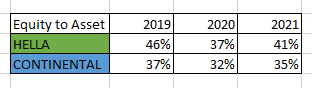{width="3.2504538495188102in"
height="0.9167946194225722in"}

3.2.4: Degree of Financial Leverage:

It is the ratio between the Earnings before interest and tax by the
earnings before tax. It shows how leveraged the company is by analysing
how much interest the company is paying as the interest.

> Degree of Financial Leverage = $\frac{EBIT}{EBT}$

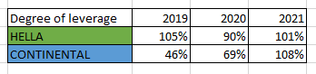{width="3.6255063429571304in"
height="0.8542858705161854in"}

3.3 Growth Rate Analysis:

This ratio evaluates at which rate at which growth rate the company is
growing from its prior performance.

3.3.1 P/E Ratio:

The Price to Earnings ratio evaluates the current share price of the
company to its earnings per share at the given period. This helps us to
understand whether the company is overvalued or undervalued.

> P/E = $\frac{MARKET\ VALUE\ OF\ SHARE}{EARNINGS\ PER\ SHARE}$

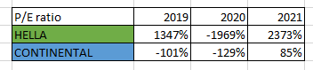{width="3.667178477690289in"
height="0.8230314960629921in"}

3.3.2 PEG Ratio:

It is the ratio between the company's price to earning per share with
the companies expected growth rate.

> PEG = $\frac{P/E}{EPS\ GROWTH\ RATE}$

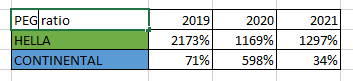{width="3.6775962379702536in"
height="0.8438681102362204in"}

3.4 Profitability Analysis:

This analysis indicates how efficiently a company generates profits and
value for shareholders.

3.4.1 Operating Profit Margin:

It shows how much income is produced by operation with respect to the
total revenue generates by the company.

> Operating profit margin = $\frac{OPERATING\ INCOME}{REVENUE}$

{width="3.6359241032370955in"
height="0.8438681102362204in"}

3.4.2 Net Profit Margin:

This ratio evaluates the net income left to its total revenue of the
company.

> Net profit margin = $\frac{NET\ INCOME}{REVENUE}$

{width="3.698432852143482in"
height="0.8855402449693788in"}

3.4.3 Cash Flow Margin:

It denotes the cash expenses/incomes of the company at a particular
period. The non-cash expenses are added back to the income.

> Cash Flow Margin = Net income + Non cash items + Change in WC

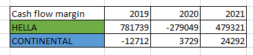{width="3.8234503499562553in"
height="0.8438681102362204in"}

3.5 Liquidity Analysis:

This ratio denotes the ability of the company to meet its short-term
liabilities and needs.

3.5.1 Cash Ratio:

It gives the ratio of how much short-term asset the company having with
respect to its current liabilities.

> Cash Ratio = $\frac{CURRENT\ ASSET - INVENTORY}{CURRENT\ LIABILITY}$
>
> {width="3.771359361329834in"
> height="0.7917771216097987in"}

3.6 Efficiency Analysis:

This analysis helps to determine how efficiently the company is
performing and how efficiently the company manages its inventories and
payables and receivables.

3.7 Cash Flow Analysis:

This analysis is used to determine the cash flow contribution of
different activities to the total revenue.

3.7.1 Operating Cash Flow:

OCF is used to find how much cash is contributed by the operating
activities in the total revenue. This gives a clear idea about the
efficiency of the operating sector too.

> OCF = Net Income + non-cash expenses -- Increase in WC

{width="3.7921959755030623in"
height="0.8334492563429571in"}

3.7.2 Free cash Flow:

FCF shows the remaining cash which is present after paying all its
bills. It is the free cash which is left over so it can you used at
anything.

> FCF = Operating CF - CapEX

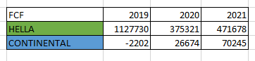{width="3.771359361329834in"
height="0.9063768591426071in"}

3.8 Rate of Returns:

It is the risk adjusted rate of returns which an investor expected for
his investments.

3.8.1 Return on Assets:

ROA determines the rate at which the company is producing profit with
respect to its total assets.

> ROA = $\frac{NET\ INCOME}{TOTAL\ ASSET}$

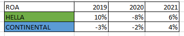{width="3.760941601049869in"
height="0.7501049868766404in"}

**4. BUSINESS ANALYSIS**

In Business analysis one will analyse the whole company and suggestions
or plans are made for the changes which has to be done in firm for
better results. The company is analysed with the whole economy and with
its competitors to get a clear picture of the company's current position
and what changes has to be done.

4.1 SWOT Analysis:

In SWOT analysis the strength, weakness, opportunities and threats of
the company is found out and changes will be made accordingly to it.

Strength:

  -----------------------------------------------------------------------
  HELLA                               CONTINENTAL AG
  ----------------------------------- -----------------------------------
  Global presence                     Strong in Europe

  Highly developed R&D unit           Highly developed R&D unit

  Operational performance and strong  Balances sales distribution
  growth rate than the market         

  Good environment for employees      Going to be one of the fastest
                                      growing automotive technologies

  Good portfolio and Investments      Separate division for product
                                      differentiation
  -----------------------------------------------------------------------

Weakness:

  -----------------------------------------------------------------------
  HELLA                               CONTINENTAL AG
  ----------------------------------- -----------------------------------
  Low profitability due to high       Weak demand in tires causes slow
  infrastructure cost                 growth rate

  Bad supply chain management         
  -----------------------------------------------------------------------

Opportunities:

  -----------------------------------------------------------------------
  HELLA                               CONTINENTAL AG
  ----------------------------------- -----------------------------------
  High demand for performance         Growing opportunities in hybrid and
  boosting automotive parts           electric vehicle wheel segment

  Asian markets huge demand for       Automated and autonomous driving is
  automotive components               in trend

  Open alliances help to grow faster  Tapping technology creators' market
                                      in two wheelers
  -----------------------------------------------------------------------

Threats:

  -----------------------------------------------------------------------
  HELLA                               CONTINENTAL AG
  ----------------------------------- -----------------------------------
  Cybersecurity threat reduces the    Highly dependent on rubber
  demand on new technologies          manufacturing.

  Technology bans certain area        Financial risk

  Global shortage of semi-conductors  
  -----------------------------------------------------------------------

4.2 PESTLE Analysis:

This analysis is used to find the external factors which influences the
performance of the company.

Political:

  -----------------------------------------------------------------------
  HELLA                               CONTINENTAL AG
  ----------------------------------- -----------------------------------
  In Germany high vehicle tax for     Government in favour of
  high emission vehicle.              eco-friendly products.

  Germany is going to pass the act on Shortage supply of gas due to
  autonomous driving                  Russia Ukraine war.

                                      Closure of plant in Russia due to
                                      war

                                      Trade protectionist policies of
                                      trump
  -----------------------------------------------------------------------

Economic:

  -----------------------------------------------------------------------
  HELLA                               CONTINENTAL AG
  ----------------------------------- -----------------------------------
  Global automotive motor market is   Impact of macroeconomic conditions
  expected to grow in high rate       prevailing in operating regions.

  Automotive market recovery from     
  pandemic is expected to be slow     
  -----------------------------------------------------------------------

Social:

  -----------------------------------------------------------------------
  HELLA                               CONTINENTAL AG
  ----------------------------------- -----------------------------------
  High demand for modifications in    E- commerce in tyre segment rises.
  vehicles.                           

  Upcoming smart city projects        Group operations have been reduced
                                      due to covid-19
  -----------------------------------------------------------------------

Technological:

  -----------------------------------------------------------------------
  HELLA                               CONTINENTAL AG
  ----------------------------------- -----------------------------------
  Global ADAS technology have a high  Conquering challenges in motor
  growth potential                    races

  Automotive radar technology         Advances safety and security for
                                      tyres

                                      Cyber security solutions for
                                      connected vehicle electronics
  -----------------------------------------------------------------------

Legal:

  -----------------------------------------------------------------------
  HELLA                               CONTINENTAL AG
  ----------------------------------- -----------------------------------
  German corporate tax remains        Improve intellectual property laws
  unchanged                           and consumer protection laws

  -----------------------------------------------------------------------

Environmental:

  -----------------------------------------------------------------------
  HELLA                               CONTINENTAL AG
  ----------------------------------- -----------------------------------
  Strict vehicle guidelines due to    Reduction in CO2 emission
  increased pollution from AVs        

  Highly sustainable safe and         
  efficient products are manufactured 
  -----------------------------------------------------------------------

**5. FINDINGS**

-   The ROCE value of Hella is highly volatile, it was so high in 2019
    which is due to disposal of asset which is not a good sign but in
    2020 and 2021 it started increasing which is a good sign. But the
    ROCE value of Continental increased gradually which indicates a good
    usage of capital.

-   ROS value of Hella is high on compared with Continental this shows
    that Hella is having large amount of operating profit contributing
    to its net sales which is positive for Hella.

-   Asset utilisation ratio of Hella is high and moving in a positive
    way which shows they are good in utilising the asset to make revenue
    that Continental.

-   Both the companies have an average of 25% as their Gross profit
    margin which is a good sign.

-   The current ratio of both the companies are increasing over time
    which denotes they are increasing its current assets over time.

-   Comparing with Continental, Hella is less funded with debt than
    equity which is a positive sign and Hella is reducing its debt
    periodically which makes Hella better than its competitor
    Continental.

-   Hella is increasing its EBIT and reduced its interest expenses over
    time, that is they are good in paying its interest dues. The value
    is high on 2019 due to the interest and tax benefits.

-   The stock turnover days of both the companies are increasing which
    denotes they are struggling to convert its inventory to sales this
    is not a good sign for both the companies.

-   The account receivable days of Hella is decreasing periodically
    which denotes they are good in collecting the credit sales amount;
    however, Continental is not performing well in recollecting its
    credit sales.

-   The account payable days of Hella is averagely maintained at 48 days
    which is better than Continental.

-   The ROE of Hella is so volatile over the past three years, this
    denotes they are not consistent in producing returns with respect to
    equity. The high fluctuation is because of the change in equity. But
    Continental is performing good in that category and increasing
    returns constantly.

-   The debt-to-equity ratio of both the companies are similar, they
    both have higher debt than equity and both are reducing it
    periodically.

-   Hella is funded on an average of 60% in debt and 40% through equity
    where Continental is funded on average of 65% in debt and 35% in
    equity.

-   Hella is highly leveraged than Continental which is like a
    double-edged sword, if they utilise the leverage properly it will be
    a positive scenario or else, they will face huge losses.

-   By the P/E ratio we can easily find that Hella's share prices are
    trading on a higher slab when compared to Continental.

-   Both the companies are maintaining an average of 75% as there
    operating profit margin which is good.

-   The net income margin of Hella jumps and drops drastically due to
    their asset disposal process and new debts which is a negative point
    for the firm, were Continental is increasing its net profit margin
    gradually.

-   The cash inflow of Hella in 2019 and 2020 is due to new debts. But
    Continental have a good cash flow margin.

-   The cash ratio of Hella is higher when compared to Continental and
    Hella is increasing the ratio over time which denotes they have
    increased its current assets.

-   The OCF and FCF of both the companies are increasing over time.

-   Hella is producing higher returns than Continental and the values
    are increasing periodically.

**6. CONCLUSIONS**

From the above findings we can clearly get the idea of how both the
companies are performing and their advantages and disadvantages.

6.1 From my analysis,

Hella shouldn't have a concern about its competitor Continental due to
the following reasons.

-   Hella have a world-wide network and majority of the sales are from
    Europe - 30%, Germany - 30%, Asia and America - 40%. But for
    Continental most of its sales is from Europe so Hella have a huge
    advantage.

-   Hella's main sales is from automotive parts mainly by sensors and
    lighting systems and integrated circuits but Continentals main
    product is tyres and advanced safety technologies.

-   Hella have large alliances they have partnered with many new
    companies to develop new technologies and to extent their market
    which gives a great advantage to Hella.

I have analysed the post pandemic performance of both the companies and
found that Hella's performance after pandemic is not stable that is
because of the new debts and asset disposals were Continental gave a
gradual improvement periodically.

After analysis the reports my suggestions for the companies are

-   Hella should make some major changes in their asset and debt
    management systems. They should come up with better investment
    decisions.

-   Continental is performing well and stable still they should come up
    with strategies to increase their sales and converting sales to net
    profit.

**7. REFERENCES**

-   Johnson, C.G., 1970. Ratio analysis and the prediction of firm
    failure. *The Journal of Finance*, *25*(5), pp.1166-1168

-   Lesakova, L., 2007, June. Uses and limitations of profitability
    ratio analysis in managerial practice. In *International Conference
    on Management, Enterprise and Benchmarking* (Vol. 259).

-   Heckman, J.J., Moon, S.H., Pinto, R., Savelyev, P. and Yavitz, A.,
    2010. *A new cost-benefit and rate of return analysis for the Perry
    Preschool Program: A summary* (No. w16180). National Bureau of
    Economic Research.

-   Greene, W.H., 2008. The econometric approach to efficiency
    analysis. *The measurement of productive efficiency and productivity
    growth*, *1*(1), pp.92-250.

-   Radford, P.J., 1967. Growth analysis formulae‐their use and abuse
    1. *Crop science*, *7*(3), pp.171-175.

-   Palepu, K.G. and Healy, P.M., 2013. *Business analysis and
    valuation*. South-Western, Cencage Learning.

-   Leigh, D., 2009. SWOT analysis. *Handbook of Improving Performance
    in the Workplace: Volumes 1‐3*, pp.115-140.

-   Perera, R., 2017. *The PESTLE analysis*. Nerdynaut.

-   Anggraini, N.T., 2022. Analysis of Financial Statements Based on
    Financial Ratio and Vertical-Horizontal Method in PT Unilever, Tbk,
    2016-2017 Period. *Journal of Social Science*, *3*(1), pp.171-176.
